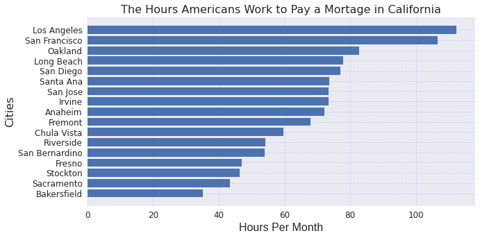

# Hours to Pay a Mortgage 

Americans work tirelessly to achieve the american dream of owning a house, living a comfortable lifestyle, and having a secure retirement. This lifestyle entirely depends on where you choose to build that life. With many places in America to pick from to settle down in you might want to take into consideration the cost of living in that area. The median home prices, median household income, and monthly mortgage payments play a big role in making that decision. 

As California being one of the most expenive state to live in, I have a visualization of how many hours you would have to work to pay off a mortgage. 

